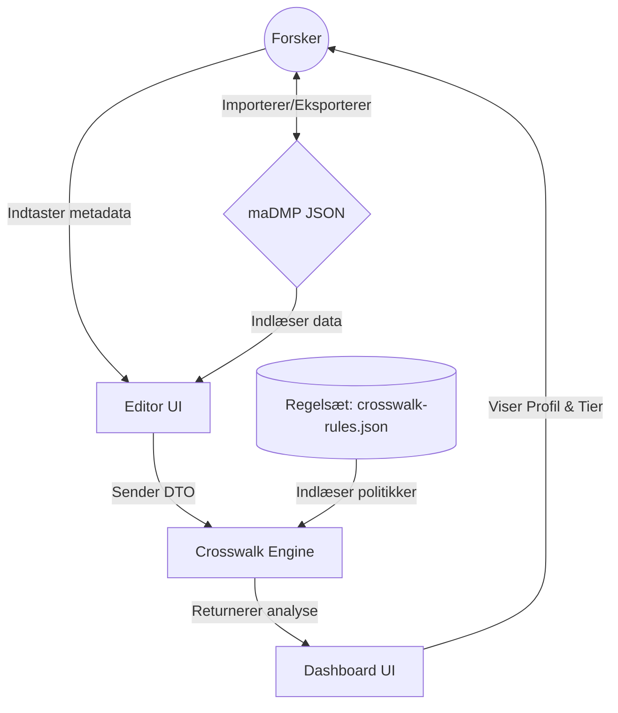

# maDMP Compliance & Storage Tier Tool

**Automatiseret mapping af forskningsdata til sikkerhedsprofiler og storage tiers.**

Et webbaseret værktøj der lader forskere beskrive deres datasæt via [RDA maDMP Common Standard v1.2](https://github.com/RDA-DMP-Common/RDA-DMP-Common-Standard) og automatisk mapper beskrivelsen til danske compliance-krav, sikkerhedsprofiler og storage tier-anbefalinger.

> Udviklet i konteksten af rapporten *"Strategisk rapport: Informationssikkerhed og IT-sikkerhed for Forskningsdata"* (April 2026).

---

## 🚀 Kom i gang

### Online (GitHub Pages)

Besøg: **[https://rolfmadsen.github.io/datamanagementplan/](https://rolfmadsen.github.io/datamanagementplan/)**

### Lokalt

```bash
git clone https://github.com/rolfmadsen/datamanagementplan.git
cd datamanagementplan
python3 -m http.server 8080
# Åbn http://localhost:8080/src/index.html
```

Eller brug VS Code Live Server og åbn `src/index.html`.

---

## 📋 Funktioner

- **Dual-view interface**: Skift lynhurtigt mellem maDMP-editoren og compliance-dashboardet.
- **Policy-as-Code**: Automatiseret validering mod danske og europæiske regulatoriske krav.
- **Visual Compliance Engine**: Real-time feedback på sikkerhedsprofil og anbefalede storage-platforme.
- **Import/Eksport**: Fuld understøttelse af RDA maDMP Common Standard v1.2.
- **Rapport-generering**: Eksporter din compliance-analyse direkte til Word (.doc) til brug i projektansøgninger.

---

## 🧠 Arkitektur og Logik

Dette afsnit beskriver den bagvedliggende "Policy-as-Code" (Crosswalk) motor, der automatisk mapper forskningsdatasæt til sikkerhedsprofiler og storage tiers ud fra RDA maDMP Common Standard v1.2.

### 1. Systemarkitektur & Dataflow

Applikationen er bygget som en ren client-side (frontend) løsning, hvor al data og regelbehandling sker lokalt i brugerens browser for maksimal datasikkerhed.



### 2. Sikkerhedsprofiler (Compliance Logik)

Motoren tildeler hvert datasæt en sikkerhedsprofil fra 0 (Grøn) til 3 (Rød). Den endelige sikkerhedsprofil for hele projektet (DMP-niveau) bestemmes ud fra det strengeste (højeste) niveau blandt alle datasæt:
`overallProfile = Math.max(0, ...datasetResults.profile)`

| Betingelse (Trigger i maDMP JSON) | Hjemmel | Konsekvens | Påkrævede foranstaltninger (Uddrag) |
|:---|:---|:---:|:---|
| `personal_data == "yes"` | GDPR Artikel 6 | 🟡 Gul (1) | Kryptering, logning, dokumentation af behandlingsgrundlag. |
| `ethical_issues_exist == "yes"` | Dansk kodeks (2026) | 🟡 Gul (1) | Dok. etisk vurdering, komité-godkendelse. |
| Sikkerhedsnøgleord (f.eks. biometri, dna) | DBL § 10 | 🟠 Orange (2) | Skærpet adgangskontrol, NDA for brugere. |
| `closed access` + Persondata/Følsomt | NIS2 § 6 | 🟠 Orange (2) | Always-On VPN, Lokal MFA, 12 mdr. log-retention. |
| `sensitive_data == "yes"` | GDPR Art. 9 / DBL § 10 | 🔴 Rød (3) | Isolation (Safe Haven), fuld audit-logning. |

### 3. Logik for Storage Tiers (Livscyklus)

Valget af Storage Tier afhænger af projektets fase, typen af hardware og behovet for samarbejde.

```mermaid
flowchart TD
    Start([Start]) --> Dates{Er alle slutdatoer\npasseret?}
    Dates -- Ja --> Cold[<b>COLD (Arkiv)</b>\nGDPR Art. 17 / WORM krav]
    Dates -- Nej --> HPC{Er der behov for\nHPC/GPU-ressourcer?}
    HPC -- Ja --> Critical[<b>CRITICAL</b>\nHigh Performance Computing]
    HPC -- Nej --> Version{Understøtter host\nversionsstyring?}
    Version -- Ja --> Warm[<b>WARM</b>\nCollaboration / Deling]
    Version -- Nej --> Hot[<b>HOT</b>\nStandard Active Research]
```

### 4. Tredjelandsoverførsler (URIS / GDPR Kap. V)

Motoren skanner metadata for at identificere risikoen for tredjelandsoverførsler. Dette genererer advarsler, hvis landekoder i `distribution.host.geo_location` eller `contributor.affiliation` ikke findes i Datatilsynets liste over sikre lande (adequacy decision). Dette udløser krav om:
- **Transfer Impact Assessment (TIA)**
- **Standardkontraktbestemmelser (SCC)**

### 5. Anbefaling af Platforme

Motoren kobler den fundne Profil og Tier for at anbefale en specifik it-platformstype:

- **Aktiv fase (Critical, Hot, Warm):**
    - Profil 0-1 → *Standard Forskningsstorage (Aktiv)*
    - Profil 2-3 → *Højsikkerheds Analyseplatform (Aktiv)*
- **Passiv fase (Cold):**
    - Profil 0-1 → *Standard Langtidsarkiv (Passiv)*
    - Profil 2-3 → *Sikkert WORM-Arkiv (Passiv)*

---

### Import / Eksport

- **Importér** en eksisterende maDMP JSON-fil (drag-and-drop eller fil-vælger)
- **Eksportér** udfyldt formular som maDMP JSON
- **Download compliance-rapport** som tekstfil

---

## 🧪 Prøv med eksempeldata

Værktøjet inkluderer 10 RDA-eksempelfiler direkte i **📋 Eksempler**-menuen i toppen. Prøv f.eks. `ex9` som indeholder 3 datasæt med varierende compliance-profiler:

| Dataset | Persondata | Følsomt | Forventet profil |
|---------|:---:|:---:|:---:|
| Client application | Nej | Nej | 🟢 Grøn |
| Image collection | Nej | Ja | 🔴 Rød |
| Interviews | Ja | Nej | 🟡 Gul |

1. Åbn værktøjet
2. Vælg **📋 Eksempler → ex9** i header-menuen
3. Se compliance-analysen i **📊 Dashboard**
4. Skift til **✏️ Editor** for at tilrette felterne og se ændringerne live

---

## 🏗️ Arkitektur

Ren client-side applikation (HTML + CSS + JavaScript). Ingen build-step, ingen server, ingen afhængigheder.

```
datamanagementplan/
├── index.html                          ← Redirect til src/ (GitHub Pages)
├── example_dmp_metadata/               ← RDA eksempelfiler (fra RDA-DMP-Common-Standard)
│   ├── ex8-dmp-minimal-content.json
│   ├── ex9-dmp-long.json
│   └── ...
├── schema/
│   └── maDMP-schema-1.2.json          ← RDA maDMP v1.2 JSON Schema
├── src/
│   ├── index.html                     ← App shell
│   ├── css/styles.css                 ← KU designskabelon
│   ├── js/
│   │   ├── app.js                     ← Entry point
│   │   ├── schema-loader.js           ← JSON Schema resolver
│   │   ├── crosswalk-engine.js        ← Compliance mapping motor
│   │   ├── editor.js                  ← Dynamisk maDMP-formular
│   │   ├── dashboard.js               ← Compliance dashboard
│   │   └── import-export.js           ← JSON import/eksport
│   └── data/
│       └── crosswalk-rules.json       ← Deklarative crosswalk-regler
```

---

## 📦 RDA maDMP Common Standard

Dette projekt anvender JSON Schema og eksempelfiler fra [RDA DMP Common Standards Working Group](https://github.com/RDA-DMP-Common/RDA-DMP-Common-Standard):

- **`schema/maDMP-schema-1.2.json`** — JSON Schema der definerer den maskinlæsbare DMP-struktur (maDMP v1.2)
- **`example_dmp_metadata/`** — Eksempelfiler fra RDA-repositoriet (ex1–ex10), der demonstrerer forskellige DMP-scenarier

Schema og eksempelfiler er publiceret af RDA under [The Unlicense](https://github.com/RDA-DMP-Common/RDA-DMP-Common-Standard/blob/master/LICENSE.md) (public domain). Se den officielle [RDA maDMP specification](https://doi.org/10.15497/rda00039) for fuldstændig dokumentation.

---

## 📚 Grundlag

- [RDA maDMP Common Standard v1.2](https://github.com/RDA-DMP-Common/RDA-DMP-Common-Standard) — Schema og eksempler (The Unlicense)
- [Databeskyttelsesloven](https://www.retsinformation.dk/eli/lta/2024/289) — DBL § 10 (følsomme oplysninger)
- [Databeskyttelsesforordningen (GDPR)](https://www.retsinformation.dk/eli/retsinfo/2016/679) — Artikel 6, 9, 17
- [NIS2-loven](https://www.retsinformation.dk/eli/lta/2025/434)
- [Datatilsynet — Tredjelandsoverførsler](https://www.datatilsynet.dk/internationalt/tredjelandsoverfoersler)
- [URIS-retningslinjer](https://ufm.dk/publikationer/2022/maj/afrapportering-udvalg-om-retningslinjer-for-internationalt-forsknings-og-innovationssamarbejde/)
- [Dansk kodeks for integritet i forskning (2026)](https://ufsn.dk/publikationer/2026/januar/det-danske-kodeks-for-integritet-i-forskning/)
- [Københavns Universitets designguide](https://designguide.ku.dk)

---

## 📄 Licens

Dette projekt er licenseret under **GNU General Public License v3.0** — se [LICENSE](LICENSE).

**Bemærk:** JSON Schema og eksempelfiler i `schema/` og `example_dmp_metadata/` stammer fra [RDA-DMP-Common-Standard](https://github.com/RDA-DMP-Common/RDA-DMP-Common-Standard) og er publiceret under [The Unlicense](https://unlicense.org/) (public domain). The Unlicense er fuldt kompatibel med GPL 3.0 — public domain-materiale kan frit inkorporeres i GPL-licenserede projekter.

